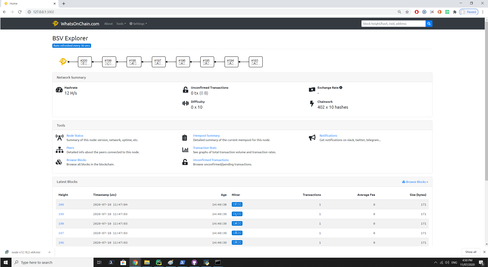
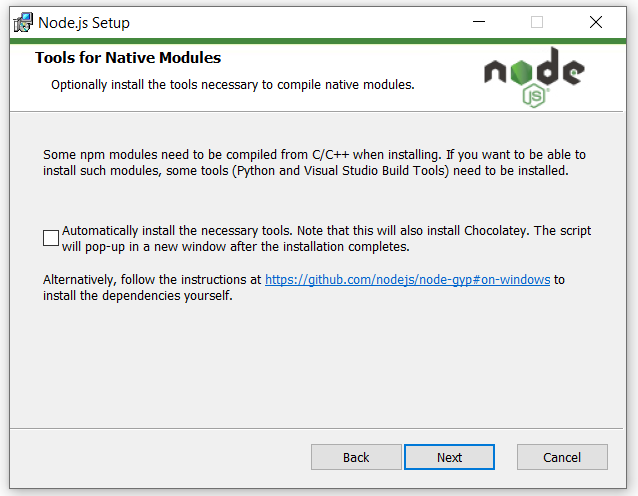

# RegTest Whatsonchain block explorer
When you have success you should see this (note block height=200 because it is on RegTest network):

# Step 1: Install node.js
Go to: https://nodejs.org/en/
and install node.js version 12 LTS or later

BUT please leave this box unchecked!
(we need to configure the npm-gyp python manually in step 2)

# Step 2 (configure npm-gyp for python)

open a terminal window and type:

    > npm config set python /path/to/executable/python

# Step 3 (use the sdk to install and run)
Clone this repository and install package:

    > electrumsv-sdk install whatsonchain
    > electrumsv-sdk start node
    > electrumsv-sdk start simple_indexer
    > electrumsv-sdk start reference_server
    > electrumsv-sdk start whatsonchain

Webpage is viewable at http://127.0.0.1:3002/

**You need to be running the node and ideally the two servers to have anything to look at.
Hence why the node and the two servers are also started here.**

The docker build for this explorer doesn't work for me at the moment. YMMV.
