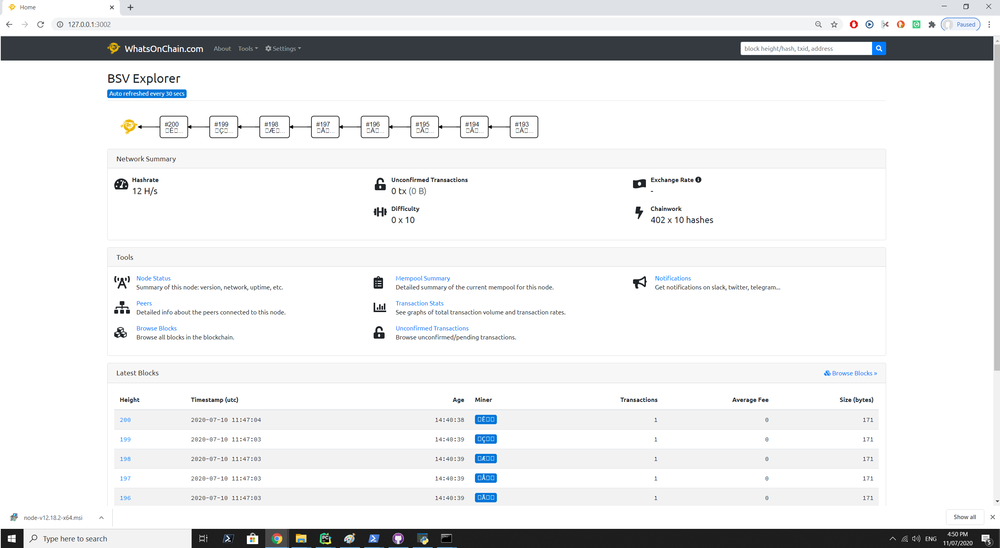

Whatsonchain
================

RegTest Whatsonchain block explorer - a minimally modified fork of https://github.com/waqas64/woc-explorer.

When you have success you should see this:

Note block height=200 because it is on RegTest network.

Run Whatsonchain
----------------------------------------

install package::

    electrumsv-sdk start node
    electrumsv-sdk start electrumx

    # Must mine at least one block for whatsonchain to display
    electrumsv-sdk node generate 1

    electrumsv-sdk start whatsonchain

Webpage is viewable at http://127.0.0.1:3002/

**You need to be running the node and ideally electrumx to have anything to look at.
Hence why the node and electrumx are also started here.**

If you forget a step, the error messages will guide you!
