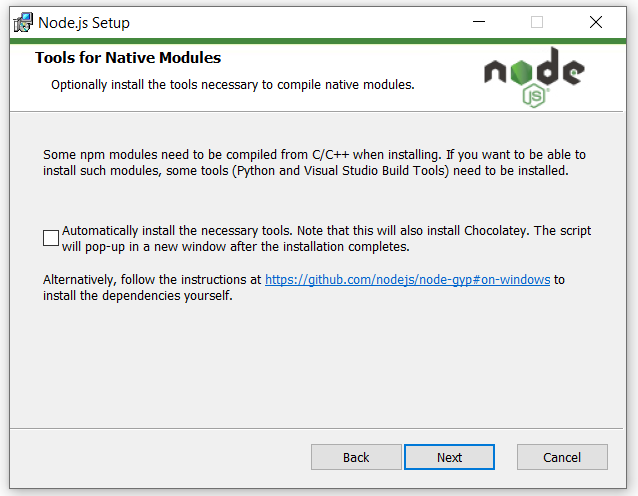

Installing the SDK
====================

Pre-requisites
---------------
All components:

- **Python3.7+** (64 bit) from: https://www.python.org/downloads/ for your platform.

For Whatsonchain:

- **Node.js (12+)**

For Merchant API:

- **Postgres**  (with a priviledged admin user: ``user=mapimaster`` and ``password=mapimasterpass``)

On linux, please install these system dependencies before proceeding::

    sudo apt-get update
    sudo apt-get install libusb-1.0-0-dev libudev-dev
    sudo apt-get install git net-tools xterm
    sudo apt-get install libssl1.0-dev   # OR libssl-dev for newer linux distros
    python3 -m pip install pysqlite3-binary

On MacOS X please install these system dependencies before proceeding::

    brew upgrade sqlite3

Install the SDK package
------------------------

To install from pypi_ run::

    pip install --upgrade electrumsv-sdk

.. _pypi: https://pypi.org/project/electrumsv-sdk/

As long as your :code:`<python dir>/Scripts` directory is in the system PATH
environment variable, you now have global access to a script called
:code:`electrumsv-sdk.exe` from any console window.

Troubleshooting (command not found - not on PATH):
~~~~~~~~~~~~~~~~~~~~~~~~~~~~~~~~~~~~~~~~~~~~~~~~~~~~~~~~~~
If the electrumsv-sdk command is not accessible yet, it will be because
the script is not on your system PATH.

On windows:

Add ``C:\Users\<username>\AppData\Local\Programs\Python\Python38\Scripts``
to your PATH in 'system environment variables' (from the windows search bar)
and reload a new terminal window to try again. (substituting <username> and Python38 as
appropriate).

On MacOSX::

    sudo nano /etc/paths

    # Add these two lines (replacing 3.9 with your version of python)
    /Library/Frameworks/Python.framework/Versions/Current/bin
    /Library/Frameworks/Python.framework/Versions/3.9/bin

    # If you don't know your python version do:
    python3 --version

On Linux (ubuntu 18.04 and 20.04):

The ``electrumsv-sdk`` script should be found in ``$HOME/.local/bin/`` dir
and is usually on system PATH environment variable by default.

No action usually required.

If all goes well you should see this:

.. image :: ../content/show-help.gif

Install node.js (only for whatsonchain)
--------------------------------------------------

Windows
~~~~~~~~~~

1. Go to: https://nodejs.org/en/ and install node.js version 12 LTS or later

BUT please leave this box unchecked!

2. configure npm-gyp for python)

open a terminal window and type::

    > npm config set python C:\Users\<username>\AppData\Local\Programs\Python\Python38\python.exe

Linux
~~~~~~~~~~~~~
::

    sudo apt install npm nodejs node-gyp nodejs-dev

MacOS
~~~~~~~~~
::

    brew install node.js

Install Postgres
--------------------------------------------------
I suggest a system installation of postgres for Windows and MacOS rather than
using something like docker (this is because docker installations on windows
can wreak havoc with network adaptors and lead to wasted hours for the uninitiated).
But docker is always an option if you prefer.

On linux the balance shifts in favour of just using docker in my personal opinion.

Note: It is planned that in a later release we will bundle an embedded postgres
and automate the initialisation with::

    user=mapimaster
    password=mapimasterpass

Windows or MacOS
~~~~~~~~~~~~~~~~~~~~~~~~~
Go here: https://www.enterprisedb.com/downloads/postgres-postgresql-downloads
Follow the standard instruction steps.
Open PgAdmin4 in the browser (on windows) and add the superuser account
(enable all user admin privileges)::

    user=mapimaster
    password=mapimasterpass

Linux
~~~~~~~~~
Either follow these instructions here to do a system installation of postgres:
https://www.digitalocean.com/community/tutorials/how-to-install-and-use-postgresql-on-ubuntu-18-04

Setup a postgres user::

    user=mapimaster
    password=mapimasterpass

Or learn to use docker to pull an official postgres image from:
https://hub.docker.com/_/postgres

Don't forget to run it with evironment variables set for::

    POSTGRES_USER=mapimaster
    POSTGRES_PASSWORD=mapimasterpass

- The user experience of docker is much better on linux than it is on other platforms

The SDK creates the other needed database entities for you via this user account.

Install components (excluding merchant API)
----------------------------------------------------------
::

    electrumsv-sdk install node
    electrumsv-sdk install simple_indexer
    electrumsv-sdk install reference_server
    electrumsv-sdk install electrumsv
    electrumsv-sdk install whatsonchain
    electrumsv-sdk install merchant_api

.. image :: ../content/install-components.gif

Install Merchant API
---------------------
To install the Merchant API (version 1.3.0)
::

    electrumsv-sdk install merchant_api

Remember to add Your Node to the Merchant API after starting the service like this::

    curl --location --request POST 'https://127.0.0.1:5051/api/v1/Node' \
    --header 'Content-Type: application/json' \
    --header 'Api-Key: apikey' \
    --data-raw '{
        "id": "localhost:18332",
        "username": "rpcuser",
        "password": "rpcpassword",
        "remarks": "remarks"
    }' --insecure

Now you are ready to launch any component!
I suggest you now checkout:

- :doc:`start command <../commands/start>` documentation
- :doc:`stop command <../commands/stop>` documentation
- :doc:`reset command <../commands/reset>` documentation
- :doc:`node command <../commands/node>` documentation
- :doc:`status command <../commands/status>` documentation

