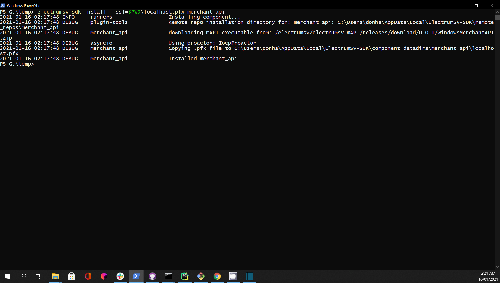

Installing the SDK
====================

Pre-requisites
---------------
All components:

- **Python3.7+** (64 bit) from: https://www.python.org/downloads/ for your platform.

For Whatsonchain:

- **Node.js (12+)**

For Merchant API:

- **ASP.NET core sdk (3.1+)**
- **Postgres**  (with a priviledged admin user: ``user=mapimaster`` and ``password=mapimasterpass``)

On linux, please install these system dependencies before proceeding::

    sudo apt-get update
    sudo apt-get install libusb-1.0-0-dev libudev-dev libssl1.0-dev
    python3 -m pip install pysqlite3-binary

On MacOS X please install these system dependencies before proceeding::

    brew upgrade sqlite3

Install the SDK package
------------------------

To install from pypi_ run::

    pip install --upgrade electrumsv-sdk

.. _pypi: https://pypi.org/project/electrumsv-sdk/

As long as your :code:`<python dir>/Scripts` directory is in the system PATH
environment variable, you now have global access to a script called
:code:`electrumsv-sdk.exe` from any console window.

Troubleshooting (command not found - not on PATH):
~~~~~~~~~~~~~~~~~~~~~~~~~~~~~~~~~~~~~~~~~~~~~~~~~~~~~~~~~~
If the electrumsv-sdk command is not accessible yet, it will be because
the script is not on your system PATH.

On windows:

Add ``C:\Users\<username>\AppData\Local\Programs\Python\Python38\Scripts``
to your PATH in 'system environment variables' (from the windows search bar)
and reload a new terminal window to try again. (substituting <username> and Python38 as
appropriate).

On MacOSX::

    sudo nano /etc/paths

    # Add these two lines (replacing 3.9 with your version of python)
    /Library/Frameworks/Python.framework/Versions/Current/bin
    /Library/Frameworks/Python.framework/Versions/3.9/bin

    # If you don't know your python version do:
    python3 --version

On Linux (ubuntu 18.04 and 20.04):

The ``electrumsv-sdk`` script should be found in ``$HOME/.local/bin/`` dir
and is usually on system PATH environment variable by default.

No action usually required.

If all goes well you should see this:

.. image :: ../content/show-help.gif

Install node.js (only for whatsonchain)
--------------------------------------------------

Windows
~~~~~~~~~~

1. Go to: https://nodejs.org/en/ and install node.js version 12 LTS or later

BUT please leave this box unchecked!

.. image:: ./node.js_extras.png

2. configure npm-gyp for python)

open a terminal window and type::

    > npm config set python C:\Users\<username>\AppData\Local\Programs\Python\Python38\python.exe

Linux
~~~~~~~~~~~~~
::

    sudo apt install npm nodejs node-gyp nodejs-dev

MacOS
~~~~~~~~~
::

    brew install node.js

Install ASP.NET core 3.1+ (only for merchant api)
--------------------------------------------------

Windows
~~~~~~~~~~
1. Go to: https://dotnet.microsoft.com/download/dotnet-core/thank-you/sdk-3.1.405-windows-x64-installer

Verify installation success::

    > dotnet

    # Should output this:
    Usage: dotnet [options]
    Usage: dotnet [path-to-application]

    Options:
      -h|--help         Display help.
      --info            Display .NET information.
      --list-sdks       Display the installed SDKs.
      --list-runtimes   Display the installed runtimes.

    path-to-application:
      The path to an application .dll file to execute.

Linux
~~~~~~~~~~~~~
1. I recommend using ``snap`` for a self-contained installation of dotnet-sdk.

::

    sudo snap install dotnet-sdk --channel=3.1/stable --classic

It's possible you may need to manually add dotnet-sdk to your PATH in .bashrc

MacOS
~~~~~~~~~
Follow these instructions to get dotnet-sdk 3.1.x https://github.com/isen-ng/homebrew-dotnet-sdk-versions

i.e. ::

    brew tap isen-ng/dotnet-sdk-versions
    brew install --cask dotnet-sdk3-1-400

check for success::

    dotnet --list-sdks

Install Postgres
--------------------------------------------------
I suggest a system installation of postgres for Windows and MacOS rather than
using something like docker (this is because docker installations on windows
can wreak havoc with network adaptors and lead to wasted hours for the uninitiated).
But docker is always an option if you prefer.

On linux the balance shifts in favour of just using docker in my personal opinion.

Windows or MacOS
~~~~~~~~~~~~~~~~~~~~~~~~~
Go here: https://www.enterprisedb.com/downloads/postgres-postgresql-downloads
Follow the standard instruction steps.
Open PgAdmin4 in the browser (on windows) and add the superuser account
(enable all user admin privileges)::

    user=mapimaster
    password=mapimasterpass

Linux
~~~~~~~~~
Either follow these instructions here to do a system installation of postgres:
https://www.digitalocean.com/community/tutorials/how-to-install-and-use-postgresql-on-ubuntu-18-04

Setup a postgres user::

    user=mapimaster
    password=mapimasterpass

Or learn to use docker to pull an official postgres image from:
https://hub.docker.com/_/postgres

Don't forget to run it with evironment variables set for::

    POSTGRES_USER=mapimaster
    POSTGRES_PASSWORD=mapimasterpass

- The user experience of docker is much better on linux than it is on other platforms

The SDK creates the other needed database entities for you via this user account.

Install components (excluding merchant API)
----------------------------------------------------------
::

    electrumsv-sdk install node
    electrumsv-sdk install electrumx
    electrumsv-sdk install electrumsv
    electrumsv-sdk install whatsonchain

.. image :: ../content/install-components.gif

Install Merchant API
---------------------

1. **SSL certificate**

Unfortunately there is no way around this one. You need to generate a server
ssl certificate. But a script for each platform has been provided here:
https://github.com/electrumsv/electrumsv-sdk/releases/download/0.0.32/mAPI_ssl_cert_scripts.zip

Extract and change directory to your platform of choice.

Windows
~~~~~~~~~~~~~~
::

    ./dev_cert_gen.ps1   # Run from an administrator shell

Linux or MacOS
~~~~~~~~~~~~~~~~~
::

    sudo apt-get update
    sudo apt-get install dos2unix
    dos2unix dev_cert_gen.sh
    sudo apt-get install libnss3-tools
    sudo chmod +x dev_cert_gen.sh
    sudo ./dev_cert_gen.sh

There will now be a ``localhost.pfx`` in the current working directory.

2. **Install Merchant API**

::

    electrumsv-sdk install --ssl=$PWD/localhost.pfx merchant_api

This is a one-time thing and now the ``localhost.pfx`` file is stored in the
SDK datadir for merchant API.

3. **Add Your Node to the Merchant API**

::

    curl --location --request POST 'https://127.0.0.1:5051/api/v1/Node' \
    --header 'Content-Type: application/json' \
    --header 'Api-Key: apikey' \
    --data-raw '{
        "id": "localhost:18332",
        "username": "rpcuser",
        "password": "rpcpassword",
        "remarks": "remarks"
    }' --insecure

Now you are ready to launch any component!
I suggest you now checkout:

- :doc:`start command <../commands/start>` documentation
- :doc:`stop command <../commands/stop>` documentation
- :doc:`reset command <../commands/reset>` documentation
- :doc:`node command <../commands/node>` documentation
- :doc:`status command <../commands/status>` documentation

