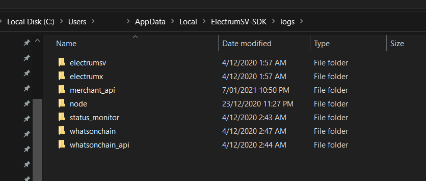

Logging
=======
Logging output is captured for all components regardless of being run with the --inline, --background or --new-terminal modifier flags.
File logging does not need to be configured for this to work as it works by redirecting stdout to file. The location of all file logging is:

On Windows :code:`C:\Users\<username>\AppData\Local\ElectrumSV-SDK\logs`

On Linux :code:`$HOME/.electrumsv-sdk/logs`

On Mac :code:`/Users/runner/.electrumsv-sdk/logs/`

The structure of the logging directory is as follows::

   ~/logs
      /<component_name>
        /component_id
          /<timestamp>.log
          /<timestamp>.log

